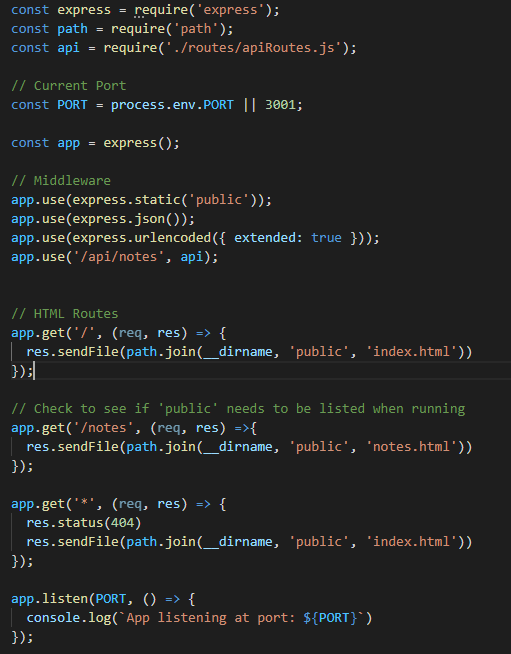
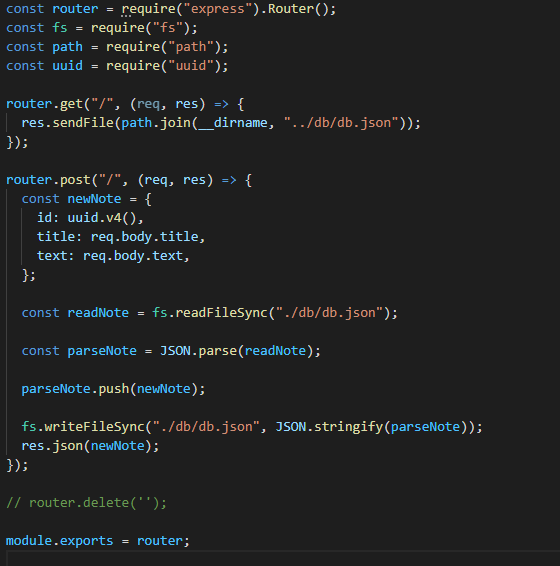
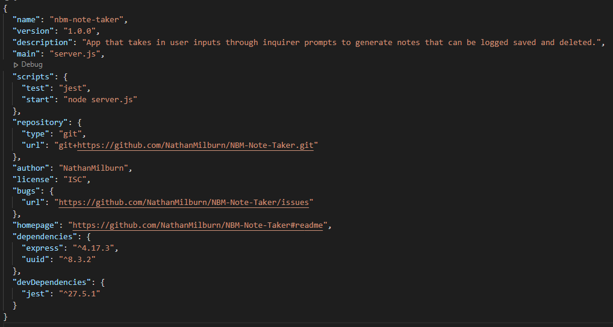

# NBM-Note-Taker

## USER STORY

    AS A web developer
    I WANT to utilize express js with pre-existing html structuring to create a live service note taker 
    SO THAT I can easily log and save notes.

## DESCRIPTION
This live server application is designed to display empty text input fields that allow the user to easily log, save, (and in the future, delete) notes. Much like the Notes app found on various mobile devices.

## APPLICATION IN USE
Once the server is running, the user can click the hyperlink for the Note Taker application and will then be directed to the main index.html page. Once at the index.html page, the user can click the "Get Started" button to be directed to the actual note taking/logging page. From there, the user can enter a title for their new note as well as an additional input field for the more specific information for each note. Once the note has a title and additional information submitted, they can click the save icon in the top right of the screen to save their note for future viewing.

Server.js file:

APIRoutes.js file:

Application in use: 
[ApplicationInUse](./public/assets/images/application-in-use.png "Application in Use")

Link to Application: 
[ApplicationLink](https://safe-scrubland-81403.herokuapp.com/ "Note Taker Application")

## TABLE OF CONTENTS
- [INSTALLATION](#installation)
- [USAGE](#usage)
- [LICENSE](#license)
- [CONTRIBUTING](#contributing)
- [QUESTIONS](#questions)

## INSTALLATION
This application required the uuid and express packages for running the server and creating unique identifiers for each note being created. 

## LICENSE

The license included for the project is under ISC

## CONTRIBUTING 
This project was contributed by utilizing the various activities for the Express.js unit of the course found at https://uwa.bootcampcontent.com/UWA-Bootcamp/uw-blv-virt-fsf-pt-12-2021-u-c/-/tree/master/11-Express/01-Activities, as well as working together with my study group partner, Daniel Juarez. 

## CHALLENGES FACED 
One of the main challenges faced with this application was getting the notes to actually save and be displayed after text inputs have been made and the save icon has been clicked. I was able to get the live server working as intended, but noticed that my logs were not being saved after hitting the save icon, and were instead vanishing without any trace of the saved note. This was fixed by checking the server.js file along with the apiRoutes.js file to ensure that the db file was properly linked to the GET and POST requests. This turned out to be an issue of one missing period when calling the file. 

## FUTURE DEVELOPMENTS 
A future development I would like to implement would be to delete notes that have been stored. I would also like to do more work with stylization on the bootstrap models to make the note taker more unique and visually pleasing to the user. I currently changed it from a green colorway to a monochromatic one to resemble ones that I see on IOS.

## QUESTIONS
If you have any further questions about this module or improvement ideas, please feel free to connect on either GitHub or LinkedIn, or email me at:
* GitHub: https://github.com/NathanMilburn
* LinkedIn: https://www.linkedin.com/in/nathan-milburn-55487513a/
* E-Mail: nathan.milburn@outlook.com